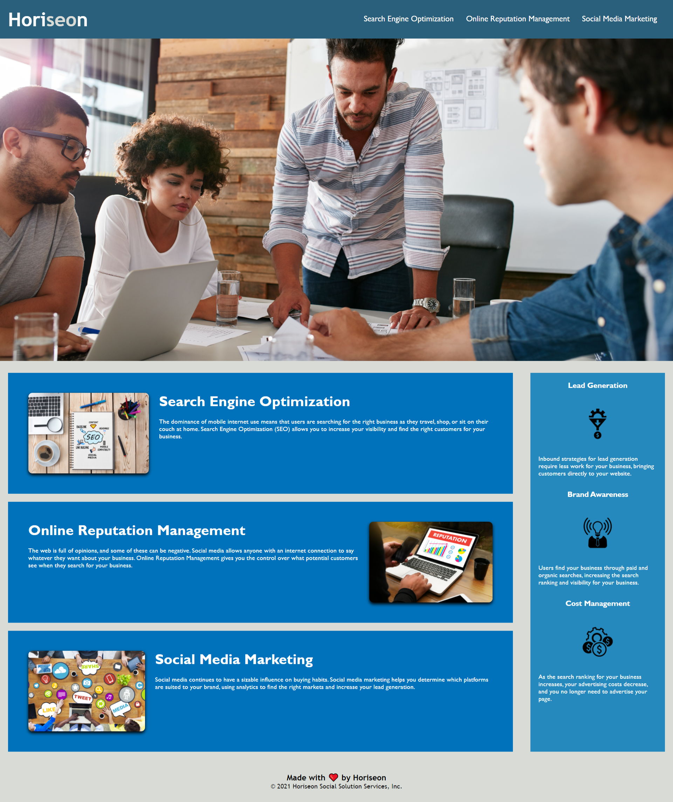

# 01 Semantics and Accessiblity

## Your Task
This website has been refactored code for Horisen Social Solution Services website so that there are now accessible feature for people with disablities. People can access Horiseon's website using assitive technologies such as video, screen readers and braille keyboards.It has seach engines.

## Acceptance Criteria

```
GIVEN a webpage meets accessibility standards
WHEN I view the source code
THEN I find semantic HTML elements
WHEN I view the structure of the HTML elements
THEN I find that the elements follow a logical structure independent of styling and positioning
WHEN I view the icon and image elements
THEN I find accessible alt attributes
WHEN I view the heading attributes
THEN they fall in sequential order
WHEN I view the title element
THEN I find a concise, descriptive title
```
> **Note**: There is starter code for this assignment.

## Screenshot

screenshot for generate HTML webpages :



Below is the link to the reafctored website :
Website URL: https://junghan84.github.io/semantics-and-accessibility/

Repository URL: 
https://github.com/junghan84/semantics-and-accessibility